# 森海克斯写频软件修改版

 

   

> [!important]
>
> + 请在使用软件前先进行备份操作！

## 简介

该写频软件使用`net6.0`+`Avalonia`
重构了森海克斯8600(pro)/8800(pro)
/GT12的原官方写频软件，并合并入一个软件中，提供对Windows、Linux、macOS三端的支持，在实现官方软件提供的所有功能基础上同时加入了其他功能，例如高级信道编辑以及蓝牙写频等。

目前适配情况：

+ 森海克斯8800/8800pro/8600/8600pro：完成
+ 森海克斯GT12：**mac端仍在测试中！如果您使用macos，欢迎在issues中提出改进意见~**

| SHX8600/8600pro/8800                   | SHX8800pro                                                | SHXGT12                                                  |
|----------------------------------------|-----------------------------------------------------------|----------------------------------------------------------|
| 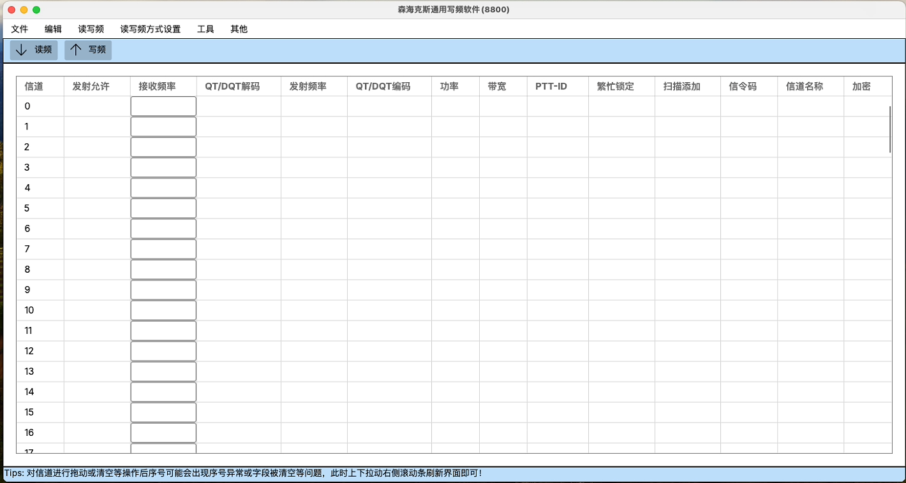 |  | 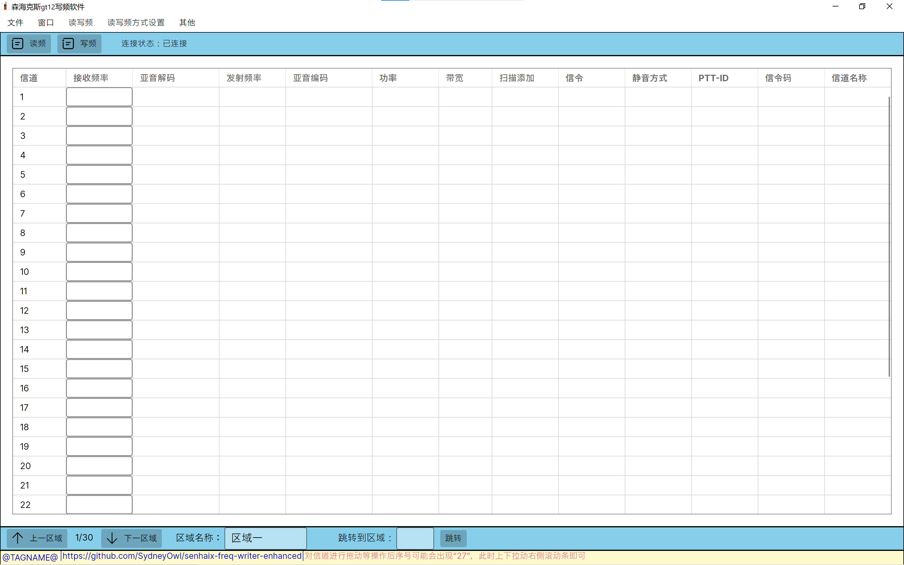 |

## 功能说明

### 运行平台

下面列出的是测试通过的平台，其他系统或发行版请自行尝试；也欢迎您在issue中告知可正常使用的系统版本！

+ windows10及以上
+ Ubuntu 20.04
+ macOS 14 (x64, Arm64)

### 支持的功能

+ 原有的所有功能
+ 高级信道编辑（顺序调整、复制粘贴等）
+ 蓝牙写频（仅8800）
+ 开机画面修改
+ 打星助手
+ 自动备份
+ 修复官方软件GT12写频后自动开启中转(#21)、取消8800/8600信道名称长度限制(#15)
+ ...

### 注意事项

+ linux平台上写频需要`sudo`！

### 其他说明

#### 蓝牙

+ 插件默认只编译了x64的版本，需要其他版本请自行编译
+ windows上若不勾选RPC方式写频，则使用的是c#的WinRT api
+ linux和mac端只能使用RPC方式写频，此方式通过客户端（见ble_plugin）的帮助实现蓝牙写频

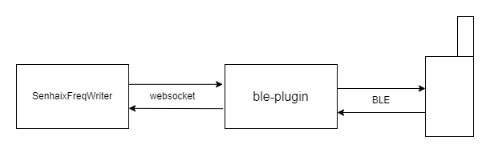

#### 图片

##### v0.2.2后

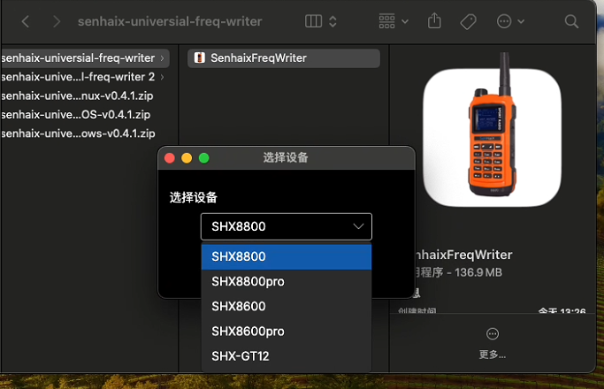

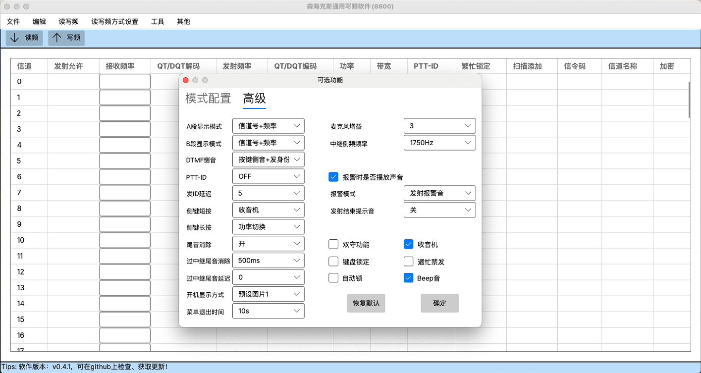

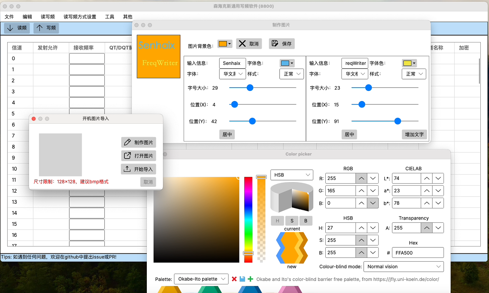

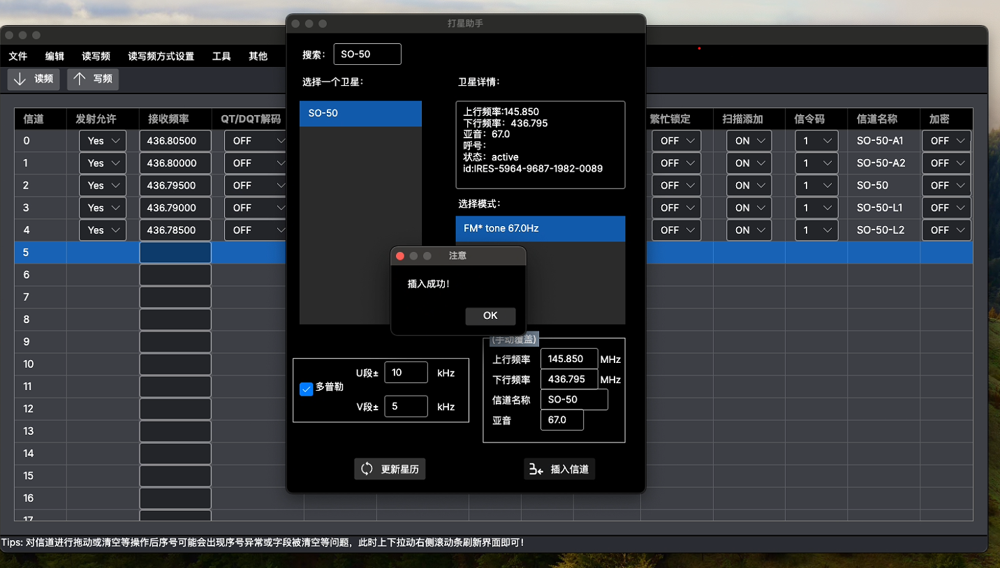


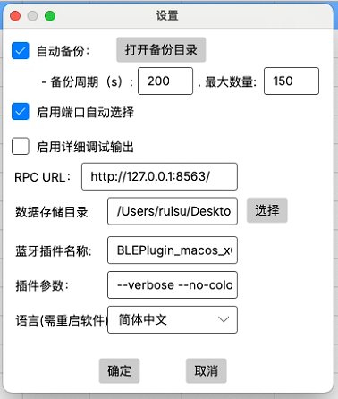

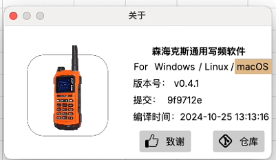


## 编译指引

如有需要，您可以在`Github Actions`中直接下载`Nightly Build`。

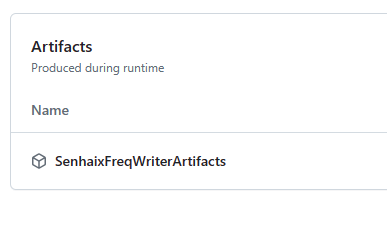

如您使用`Rider`，按照`SenhaixFreqWriter.csproj`中的注释选择合适的框架，直接publish即可！

如您使用命令行编译，按照`SenhaixFreqWriter.csproj`中的注释选择合适的框架后，可以参考`.github/workflows/build.yml`进行编译。

## 开发指引

+ 您可以自行实现跨平台版本写频软件的蓝牙功能，只需实现Utils/BLE/Interfaces/IBluetooth.cs中的方法即可。

+ 蓝牙插件若有**调试需要**，需要手动编译，或勾选了“手动控制RPC”，编译具体操作如下：

    1. 编译仓库中ble_plugin文件夹内的go项目，即`go mod tidy && go build`
        + 在windows上编译，需要gcc编译器
        + 在macOS上编译，需要安装xcode
        + 在linux上编译，需要bluez
    2. 运行写频软件，在写频方式->蓝牙中勾选`RPC`方式以及”手动控制“；
    3. 直接双击打开编译产物，或者使用命令行指定参数：

    ```bash
  BLE RPC Client - Connect shx8x00 and c#
  
  Usage:
    BLE RPC Client [flags]
  
  Flags:
        --address string   RPC Server address (default "127.0.0.1")
    -h, --help             help for BLE
        --inside-call      Call from rpc server
        --no-color         No color output in console
        --port int         RPC Server port (default 8563)
        --run-test         Execute test
        --verbose          Print Debug Level logs
        --vverbose         Print Debug/Trace Level logs
  
  ```
    4. 在写频软件中点击蓝牙搜索，正常读频写频即可

## FAQ

+ windows上若无法正常使用蓝牙写频功能，可以试着反勾选“RPC方式”后重试

+ 如果在macOS上出现提示"无法打开，因为它来自身份不明的开发者"，请在`设置-隐私与安全性-安全性`
  中手动允许应用运行。或者在命令行中执行命令：`xattr -cr （.app包的路径）`。

    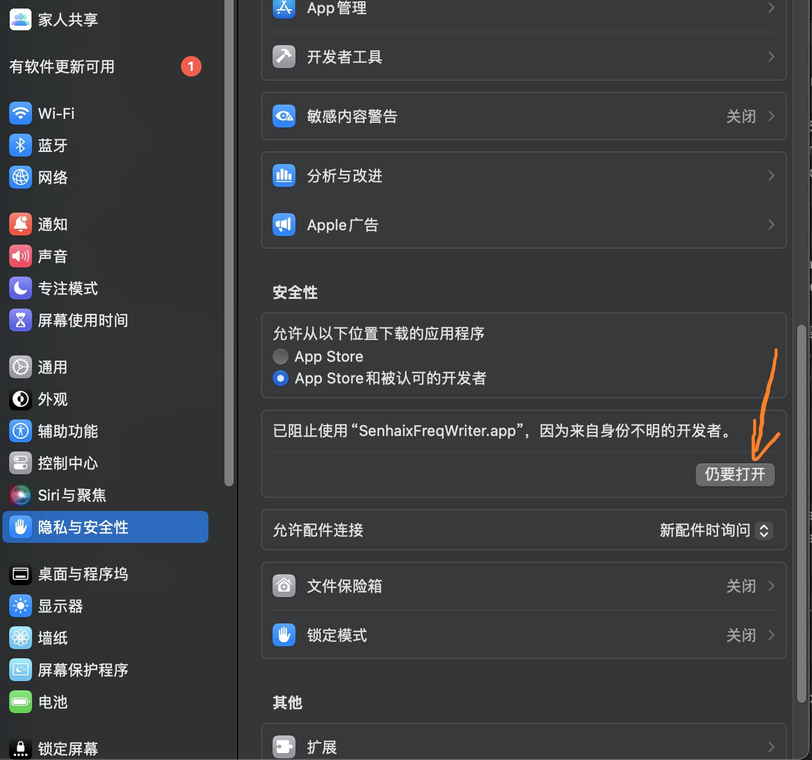

+ 如在macOS上（在macOS13及以下可能出现该问题）无法正常使用蓝牙功能，请按如下步骤操作：
    1. 下载Release中的“macOS-ble-helper”；
    2. 打开写频软件后双击运行“macOS-ble-helper” ；
    3. 勾选“手动调用RPC”后正常使用蓝牙读写频即可。

    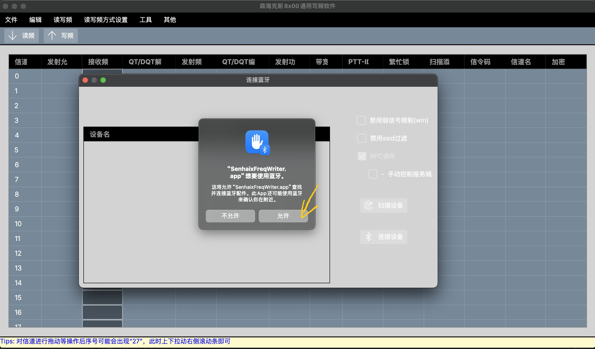

+ **(改动udev配置有风险，如果您不熟悉linux或不太了解下面的内容，请不要更改udev，继续使用root权限启动软件即可)** 如果您不希望在linux上使用sudo权限运行本软件，您可以通过更改udev规则修改设备文件的权限：
  + 对于8800(pro)/8600(pro)，您需要首先获取写频线的VID/PID，可通过执行`lsusb`后获取，本图中的写频线名称为"...ch340...."，则VID和PID分别为1a86和7523。
  
  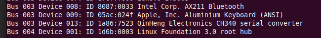

  如果是GT12，则需找到“SHX-GT12”，这是一个HID设备，记录其VID和PID，图中为28e9和028a：
  
  

  之后在`/etc/udev/rules.d/`新建配置文件，文件名如`99-senhaix.rules`，并写入如下字符串,如果有多根写频线就添加多行：
  ```text
    ATTRS{idVendor}=="你的写频线VID", ATTRS{idProduct}=="你的写频线PID", MODE="0666"
  ```
  最后重新启动udev服务`systemctl restart udev`或重启电脑，在启动写频软件时传入命令行参数`./senhaixFreqWriter --bypass-root-check`即可。

## 其他

> [!WARNING]  
> 软件还在开发中，尚不稳定，欢迎提出 issues 和 pr!

卫星频率数据来源于[amateur-satellite-database](https://github.com/palewire/amateur-satellite-database)
，参考了[业余无线电 FM 卫星频率表](https://forum.hamcq.cn/d/351)
进行了多普勒修正。可以在此处查看更多:https://forum.hamcq.cn/d/351

shx8x00软件原理:见 [ble-connector](https://github.com/SydneyOwl/shx8800-ble-connector)
以及 [config-editor](https://github.com/SydneyOwl/shx8800-config-editor)

## 免责声明

- 本软件仅供技术交流和个人学习使用。任何个人或组织在使用本软件时必须**遵守中华人民共和国相关法律法规及无线电管理条例**。
- 如因使用本软件造成数据损失，**作者不承担任何法律责任**。数据无价，提醒您注意备份！

## 版本日志

`v0.1.a` 加入了蓝牙写频和便捷的信道更改。

`v0.1.0` 修复了即使蓝牙已连接也可能提示串口未连接的问题；修正了删除或清空信道时单元格未清空的问题。

`v0.1.1` 修复了 DataGridViewX 报错问题以及集成（实验性）开机画面修改。

`v0.1.2` 增加操作指引以及蓝牙连接状态指示。

`v0.1.3` 修复了信道操作后，会自动跳回 0 信道，还得拖动滚动条下去继续操作的问题。

`v0.1.4` 优化 UI，加入 GT12写频软件。

`v0.2.0` 修复蓝牙写频结束设备断开后，重新连接设备时搜索不到设备的问题/升级dotnet版本到4.6.2 LTS/更新所用依赖版本

`v0.2.1` 加入打星助手，更换了“关于”窗体

`v0.2.2` 重写官方winform写频软件，实现跨平台，弃用winform版本软件

`v0.3.0` 加入对GT12的支持,修复了8800写频软件中亚音读取错误的问题,加入开机画面生成及修改功能，加入打星助手，通过rpc实现了跨平台的蓝牙写频功能支持

`v0.3.1` 优化使用插件的写频速度（linux和macOS），目前接近写频线速度

`v0.3.2` 允许打星助手自定义信道名称、频率及亚音，升级Avalonia版本，蓝牙插件性能改进

`v0.3.3` 禁用8600和8600pro不可修改的选项；在设备选择窗口中分离8x00为三个设备；禁用8600和8600pro窗口中的蓝牙选项；8600PRO的开机画面修改功能支持；

`v0.4.0` 增加8800pro支持、更改深色主题配色、增加”设置“项、新增备份功能、新增串口自动选择功能

`v0.4.1` 修复Issue #18(编辑内容的时候程序卡死并崩溃); 修复当频率小数部分不为125的倍数时自动修正错误的问题

`v0.4.2` 修复8800
VFO页面设置闪退问题；修复切换到同种设备后数据仍然存在的问题；修复8800pro的DTMF设置无法保存的问题；UI改进(
某些页面不再使用Canvas)；国际化(欢迎PR)；GT12写频完成后将主动切换至频率模式（默认120.0MHz），防止误触发中转

`v0.4.3` 修复GT12中转模式自动开启问题；添加中转模式可选项；

`v0.4.4` 修复打星助手还没更新完星历就关闭窗口造成的程序崩溃；Linux加入跳过Root检查，允许用户不以sudo运行软件；修复了一些bug

## 致谢

+ `SenHaiX`的原版写频软件

+ `Avalonia` 的跨平台UI方案

+ `tinygo`的BLE方案

+ `HIDSharp`的HID交互方案

+ [@rockliuxn](https://github.com/rockliuxn) 提供的图标，以及测试阶段的支持！

+ 提出issues和PRs的各位用户，感谢你们！

+ JetBrains的`Open Source License`

       

## 许可证

本项目使用`The Unlicense`进行许可。

```markdown
This is free and unencumbered software released into the public domain.

Anyone is free to copy, modify, publish, use, compile, sell, or
distribute this software, either in source code form or as a compiled
binary, for any purpose, commercial or non-commercial, and by any
means.

In jurisdictions that recognize copyright laws, the author or authors
of this software dedicate any and all copyright interest in the
software to the public domain. We make this dedication for the benefit
of the public at large and to the detriment of our heirs and
successors. We intend this dedication to be an overt act of
relinquishment in perpetuity of all present and future rights to this
software under copyright law.

THE SOFTWARE IS PROVIDED "AS IS", WITHOUT WARRANTY OF ANY KIND,
EXPRESS OR IMPLIED, INCLUDING BUT NOT LIMITED TO THE WARRANTIES OF
MERCHANTABILITY, FITNESS FOR A PARTICULAR PURPOSE AND NONINFRINGEMENT.
IN NO EVENT SHALL THE AUTHORS BE LIABLE FOR ANY CLAIM, DAMAGES OR
OTHER LIABILITY, WHETHER IN AN ACTION OF CONTRACT, TORT OR OTHERWISE,
ARISING FROM, OUT OF OR IN CONNECTION WITH THE SOFTWARE OR THE USE OR
OTHER DEALINGS IN THE SOFTWARE.

For more information, please refer to <https://unlicense.org>
```


