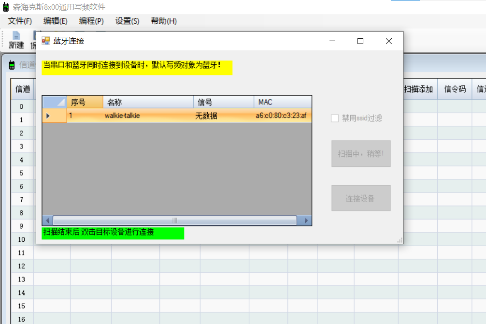

# 森海克斯8x00通用写频软件 说明

## 简介

该软件在原官方写频软件的基础上简化了对信道的操作，同时增加了蓝牙写频功能。只要打开手台蓝牙功能，不需写频线即可写频。

软件目前支持的功能：

+ 信道操作：

  + 上下拖拽调整信道顺序
  + 一键删除空信道
  + 撤回
  + 清空指定信道（右键）
  + 指定信道后插入空信道（右键）
  + 删除指定信道（右键）
  + 复制（右键）
  + 剪切（右键）
  + 粘贴（右键）

+ 蓝牙写频**：

  + 不过滤ssid
  + 不过滤rssi>=80的信号

**：仅在`bt_support`上支持。

使用视频：[软件使用示范](https://www.bilibili.com/video/BV1Et4y1R7ax/)

请注意：带有`bluetooth`字样的软件带有蓝牙写频功能，由于在.net461基础上开发且使用了BLE，故该版本至少在windows10及以上系统，且具备蓝牙硬件的电脑上方可使用。

 没有`bluetooth`字样的版本使用.net20开发，不具备蓝牙功能，在windows7及以上系统即可运行。

软件还在开发中，尚不稳定，欢迎提出issues和pr!

软件原理:见[ble-connector](https://github.com/SydneyOwl/shx8800-ble-connector)以及[config-editor](https://github.com/SydneyOwl/shx8800-config-editor)

## 版本日志

v0.1.a 加入了蓝牙写频和便捷的信道更改

v0.1.0 修复了即使蓝牙已连接也可能提示串口未连接的问题；修正了删除或清空信道时单元格未清空的问题。

TU 73
