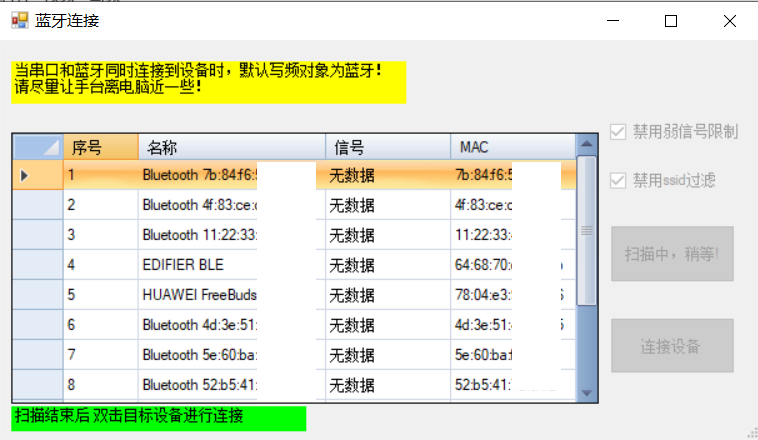
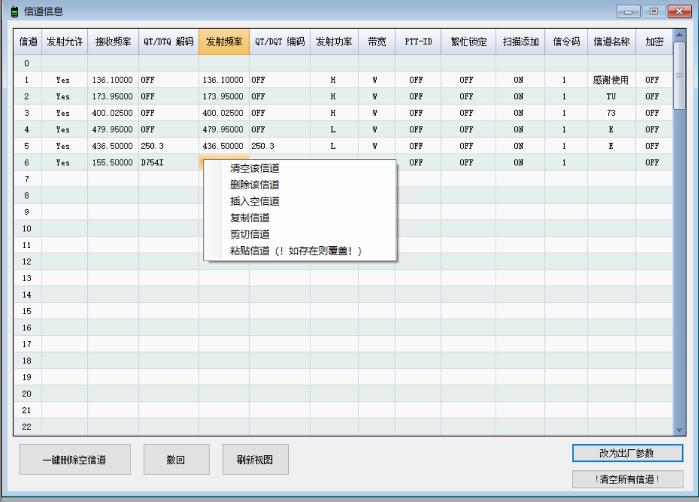

# 森海克斯8x00通用写频软件 说明

[](https://github.com/SydneyOwl/shx8x00-freq-writer-enhanced/releases?style=for-the-badge)
[](https://github.com/SydneyOwl/shx8x00-freq-writer-enhanced/releases/latest?style=for-the-badge)


## 简介

该软件在原官方写频软件的基础上简化了对信道的操作，同时增加了蓝牙写频功能。只要打开手台蓝牙功能，不需写频线即可写频。





## 功能

**使用视频：[软件使用示范](https://www.bilibili.com/video/BV1Et4y1R7ax/)**

软件目前支持的功能：

+ 信道操作：

  + 上下拖拽调整信道顺序
  + 一键删除空信道
  + 撤回
  + 清空指定信道（右键）
  + 指定信道后插入空信道（右键）
  + 删除指定信道（右键）
  + 复制（右键）
  + 剪切（右键）
  + 粘贴（右键）
  + 以及所有原有的功能

+ 蓝牙写频：

  + 不过滤ssid
  + 不过滤rssi<-80的信号
  + 连接森海克斯8800或后续成功加入蓝牙芯片的8600
  + 以及所有写频线写频支持的功能

## 注意事项

release中带有`bluetooth`字样的软件带有蓝牙写频功能，由于在.net461基础上开发且使用了BLE，**故该版本至少在windows10及以上系统，且具备蓝牙硬件的电脑上方可使用**。

 没有`bluetooth`字样的版本使用.net20开发，不具备蓝牙功能，**在windows7及以上系统即可运行**。

## 编译指引

如果需要自行编译，只需要分别对`SHX8800`和`SHX8800_nobt`进行编译即可。

`SHX8800`编译环境要求：.net4.6.1，win10+

`SHX8800_nobt`编译要求：.net2.0

## 最后...

软件还在开发中，尚不稳定，欢迎提出issues和pr!

软件原理:见[ble-connector](https://github.com/SydneyOwl/shx8800-ble-connector)以及[config-editor](https://github.com/SydneyOwl/shx8800-config-editor)

## 免责声明

- 本软件仅供技术交流和个人学习使用。任何个人或组织在使用本软件时必须**遵守中华人民共和国相关法律法规及无线电管理条例**。
- 如因使用本软件造成数据损失（理论上写频操作无此问题）,**作者不承担任何法律责任**。

## 版本日志

v0.1.a 加入了蓝牙写频和便捷的信道更改

v0.1.0 修复了即使蓝牙已连接也可能提示串口未连接的问题；修正了删除或清空信道时单元格未清空的问题。

## 许可证

```
This is free and unencumbered software released into the public domain.

Anyone is free to copy, modify, publish, use, compile, sell, or
distribute this software, either in source code form or as a compiled
binary, for any purpose, commercial or non-commercial, and by any
means.

In jurisdictions that recognize copyright laws, the author or authors
of this software dedicate any and all copyright interest in the
software to the public domain. We make this dedication for the benefit
of the public at large and to the detriment of our heirs and
successors. We intend this dedication to be an overt act of
relinquishment in perpetuity of all present and future rights to this
software under copyright law.

THE SOFTWARE IS PROVIDED "AS IS", WITHOUT WARRANTY OF ANY KIND,
EXPRESS OR IMPLIED, INCLUDING BUT NOT LIMITED TO THE WARRANTIES OF
MERCHANTABILITY, FITNESS FOR A PARTICULAR PURPOSE AND NONINFRINGEMENT.
IN NO EVENT SHALL THE AUTHORS BE LIABLE FOR ANY CLAIM, DAMAGES OR
OTHER LIABILITY, WHETHER IN AN ACTION OF CONTRACT, TORT OR OTHERWISE,
ARISING FROM, OUT OF OR IN CONNECTION WITH THE SOFTWARE OR THE USE OR
OTHER DEALINGS IN THE SOFTWARE.

For more information, please refer to <https://unlicense.org>
```

