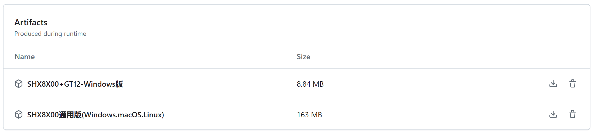

# 森海克斯修改版写频软件 说明

[](https://github.com/SydneyOwl/shx8x00-freq-writer-enhanced/releases?style=for-the-badge)
[](https://github.com/SydneyOwl/shx8x00-freq-writer-enhanced/releases/latest?style=for-the-badge)


> [!important]
> 如有必要，请在任何操作前首先进行备份操作！

> [!NOTE]  
> 为使软件实现跨平台（在**Mac/Linux**端可用），目前正在尝试使用`Avalonia`和`.NET6.0`重构写频软件，其中森海克斯8600/8800已经大致重构完成且已合并入`master`，命名为`shx8x00_universal`，这一版本在linux/macos/windows上可用，具体系统要求可见下文。


## 简介

森海克斯8800/8600（仅windows）：[森海克斯8800/8600写频软件简介](./shx8x00/readme.md)

森海克斯8800/8600（通用）:  [森海克斯8800/8600通用写频软件简介](./shx8x00_universal/readme.md)

森海克斯GT-12：[GT12写频软件简介](./GT12/readme.md)

## 功能说明

+ 仅在windows端可用的森海克斯8x00写频软件（即森海克斯8800/8600for windows）由官方软件修改而来，使用了两套solution，其中一套对所用的`.net framework`进行了适当的升级以支持`BLE`蓝牙写频。另一套solution为了尽可能适配旧系统，继续采用`.net2.0`，最低支持到windows xp sp2。
+ GT12写频软件同样由官方软件修改而来，对.net进行了小版本的升级。
+ 在windows、linux、mac通用的森海克斯8x00写频软件为实现跨平台，完全弃用官方UI代码(winform)，转而采用`Avalonia`+`.net`6进行开发。

运行平台：

| -                | 森海克斯8800/8600通用版（Windows/Linux/macOS）               | 森海克斯8800/8600 (仅Windows，有蓝牙支持) | 森海克斯8800/8600 (仅Windows，无蓝牙支持) | GT-12 (仅Windows) |
| ---------------- | ------------------------------------------------------------ | ----------------------------------------- | ----------------------------------------- | ----------------- |
| 支持的平台(理论) | windows7 sp1及以上[^1] / Ubuntu（只试过这个） 16.04, 18.04, 20.04+ / macOS 10.15+ (x64, Arm64)[^2] | windows 8及以上[^3]                       | windows xp sp2及以上                      | windows 8及以上   |

[^1]: Windows 7 SP1 is supported with [Extended Security Updates](https://learn.microsoft.com/troubleshoot/windows-client/windows-7-eos-faq/windows-7-extended-security-updates-faq) installed.
[^2]: .NET 6 is supported in the Rosetta 2 x64 emulator.
[^3]:低于win10可能无法使用蓝牙写频（仅支持8800），且可能需要安装runtime

目前各版本支持的功能：

| -                                    | 森海克斯8800/8600通用版（Windows/Linux/macOS）[^4] | 森海克斯8800/8600 (仅Windows，有蓝牙支持) | 森海克斯8800/8600 (仅Windows，无蓝牙支持) | GT-12 (仅Windows)  |
| ------------------------------------ | -------------------------------------------------- | ----------------------------------------- | ----------------------------------------- | ------------------ |
| 原有的所有功能                       | :white_check_mark:                                 | :white_check_mark:                        | :white_check_mark:                        | :white_check_mark: |
| 高级信道编辑（顺序调整、复制粘贴等） | :white_check_mark:                                 | :white_check_mark:                        | :white_check_mark:                        | :white_check_mark: |
| 蓝牙写频                             | 仅Windows； Linux和Mac版本正在等待上游依赖修复     | :white_check_mark:                        | :heavy_minus_sign:                        | :heavy_minus_sign: |
| （以下为支持的插件）                 |                                                    |                                           |                                           |                    |
| 开机画面修改                         | 开发中                                             | :white_check_mark:                        | :white_check_mark:                        | :heavy_minus_sign: |
| 打星助手                             | 开发中                                             | :white_check_mark:                        | :white_check_mark:                        | :white_check_mark: |

[^4]:该版本自带runtime，无需额外安装

## 编译指引

如有需要，您可以在`Github Actions`中直接下载`Nightly Build`。



下面描述的是如何进行手动编译。

### 非通用版

如果需要自行编译，只需要使用`Makefiile`进行编译即可。克隆仓库时请使用`--recursive`参数！

windows环境下，您可以在安装`mingw`后使用mingw32-make进行编译：

```powershell
mingw32-make #全部编译
mingw32-make gt12 #只编译GT12
mingw32-make shx8x00 #只编译支持蓝牙的shx8x00
mingw32-make shx8x00_nobt #只编译不支持蓝牙的shx8x00
```

|型号|编译要求|
|---|---|
|`SHX8800`|.net4.6.2, win10+|
|`SHX8800_nobt`|.net2.0|
|`gt12`|.net4.6.2, win8+|

> [!TIP]
> 您也可以参考`.github/workflows/build.yml`进行编译。

### 通用版

只有一点值得注意

在编译windows时请使用指定框架：**net6.0-windows10.0.19041.0**，相关PR：[No path specified for UNIX transport](https://github.com/inthehand/32feet/issues/341)

## FAQ

+ 在UNIX平台上，写频时很有可能需要`sudo`！

## 其他


> [!WARNING]  
> 软件还在开发中，尚不稳定，欢迎提出 issues 和 pr!

卫星频率数据来源于[amateur-satellite-database](https://github.com/palewire/amateur-satellite-database)，参考了[业余无线电 FM 卫星频率表](https://forum.hamcq.cn/d/351)进行了多普勒修正。另外，请注意以下几点：

+ 除亚音外，所有频率单位均为 MHz（兆赫兹）。
+ 针对 FM 卫星，默认按照 U 段 ±10KHz，V 段 ±5KHz 生成。
+ SO-50 卫星的 OPEN 阶段为转发器激活之用。若转发器已激活，可跳过本阶段。两个 OPEN 分别对应 SO-50 出现和过顶，您可根据需要发射激活亚音。**（本软件未生成OPEN阶段）**
+ CAS-3H 和 PO-101 按照时间表计划开启转发器，请关注官方发布的时间表以及开机计划。
+ ISS-FM 转发器的开启请关注最新动态，在遇到 SSTV 活动、宇航员出舱活动等情况下可能关闭。
+ AO-91 卫星目前因电池故障，只能在日光下提供转发或工作状态不稳定，可能突然关机。
中国空间站（CSS）已完成业余载荷频率协调，但截至目前，CSS 的业余载荷还并未投入使用，请关注最新消息。
+ UVSQ-SAT 卫星目前以科研任务为主，何时开放转发器也请关注最新消息。
+ Tevel 系列卫星较多，且都为同一参数。因此是按计划，在部分时间开启部分卫星的转发器，请关注最新信息以了解哪些卫星的转发器在何时处于可用状态。
+ 本表中亚音频率的单位为 Hz（赫兹）。若生成的数据亚音标注为OFF，表明此卫星转发器无需亚音即可使用。
+ *以上几点来源：https://forum.hamcq.cn/d/351

shx8x00软件原理:见 [ble-connector](https://github.com/SydneyOwl/shx8800-ble-connector) 以及 [config-editor](https://github.com/SydneyOwl/shx8800-config-editor)

## 免责声明

- 本软件仅供技术交流和个人学习使用。任何个人或组织在使用本软件时必须**遵守中华人民共和国相关法律法规及无线电管理条例**。
- 如因使用本软件造成数据损失（理论上写频操作无此问题），**作者不承担任何法律责任**。

## 版本日志

`v0.1.a` 加入了蓝牙写频和便捷的信道更改。

`v0.1.0` 修复了即使蓝牙已连接也可能提示串口未连接的问题；修正了删除或清空信道时单元格未清空的问题。

`v0.1.1` 修复了 DataGridViewX 报错问题以及集成（实验性）开机画面修改。

`v0.1.2` 增加操作指引以及蓝牙连接状态指示。

`v0.1.3` 修复了信道操作后，会自动跳回 0 信道，还得拖动滚动条下去继续操作的问题。

`v0.1.4` 优化 UI，加入 GT12写频软件。

`v0.2.0` 修复蓝牙写频结束设备断开后，重新连接设备时搜索不到设备的问题/升级dotnet版本到4.6.2 LTS/更新所用依赖版本

`v0.2.1` 加入打星助手，更换了“关于”窗体


## Thanks...

+ `Avalonia` 的跨平台UI方案

+ `InTheHand.BluetoothLE`的低功耗蓝牙方案
+ `SenHaiX`的原版写频软件
+ `Linux.Bluetooth`的`D-Bus`方案
+ [@rockliuxn](https://github.com/rockliuxn) 提供的图标，以及测试阶段的支持！
+ and more.....

## 许可证

该仓库中的三个项目均使用`The Unlicense`进行许可。

```markdown
This is free and unencumbered software released into the public domain.

Anyone is free to copy, modify, publish, use, compile, sell, or
distribute this software, either in source code form or as a compiled
binary, for any purpose, commercial or non-commercial, and by any
means.

In jurisdictions that recognize copyright laws, the author or authors
of this software dedicate any and all copyright interest in the
software to the public domain. We make this dedication for the benefit
of the public at large and to the detriment of our heirs and
successors. We intend this dedication to be an overt act of
relinquishment in perpetuity of all present and future rights to this
software under copyright law.

THE SOFTWARE IS PROVIDED "AS IS", WITHOUT WARRANTY OF ANY KIND,
EXPRESS OR IMPLIED, INCLUDING BUT NOT LIMITED TO THE WARRANTIES OF
MERCHANTABILITY, FITNESS FOR A PARTICULAR PURPOSE AND NONINFRINGEMENT.
IN NO EVENT SHALL THE AUTHORS BE LIABLE FOR ANY CLAIM, DAMAGES OR
OTHER LIABILITY, WHETHER IN AN ACTION OF CONTRACT, TORT OR OTHERWISE,
ARISING FROM, OUT OF OR IN CONNECTION WITH THE SOFTWARE OR THE USE OR
OTHER DEALINGS IN THE SOFTWARE.

For more information, please refer to <https://unlicense.org>
```
