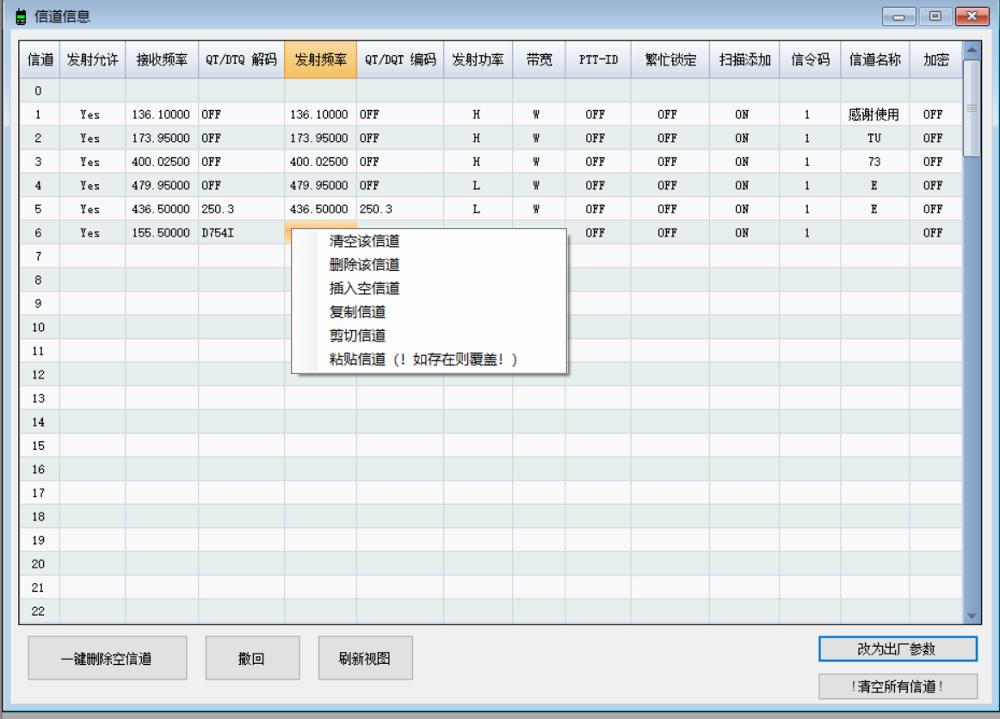

# Shx8x00写频软件 简介

**注意：该简介仅适用于森海克斯8600/8800; GT12见[GT12写频简介](./readme_gt12.md)**

该软件在原官方写频软件的基础上简化了对信道的操作，同时增加了蓝牙写频功能。只要打开手台蓝牙功能，不需写频线即可写频。

## 功能

**使用视频：[软件使用示范](https://www.bilibili.com/video/BV1Et4y1R7ax/)**

软件目前支持的功能：

+ 信道操作：

  + 上下拖拽调整信道顺序
  + 一键删除空信道
  + 撤回
  + 清空指定信道（右键）
  + 指定信道后插入空信道（右键）
  + 删除指定信道（右键）
  + 复制（右键）
  + 剪切（右键）
  + 粘贴（右键）
  + 以及所有原有的功能
+ 蓝牙写频：

  + 不过滤ssid
  + 不过滤rssi<-80的信号
  + 连接森海克斯8800或后续成功加入蓝牙芯片的8600
  + 以及所有写频线写频支持的功能
+ 其他功能
  + （实验性）蓝牙或写频线修改开机画面

## 注意事项

release中带有`bluetooth`字样的软件带有蓝牙写频功能，由于在.net461基础上开发且使用了BLE，**故该版本至少在windows10及以上系统，且具备蓝牙硬件的电脑上方可使用**。

 没有`bluetooth`字样的版本使用.net20开发，不具备蓝牙功能，**在windows7及以上系统即可运行**。